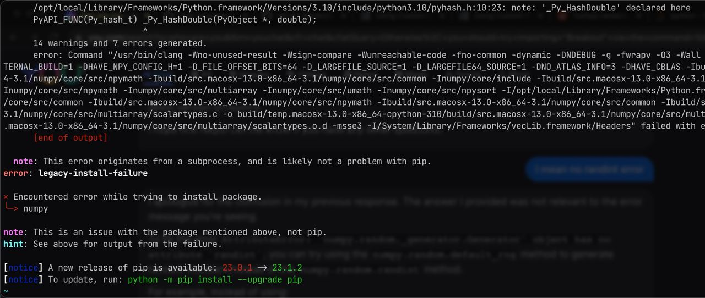
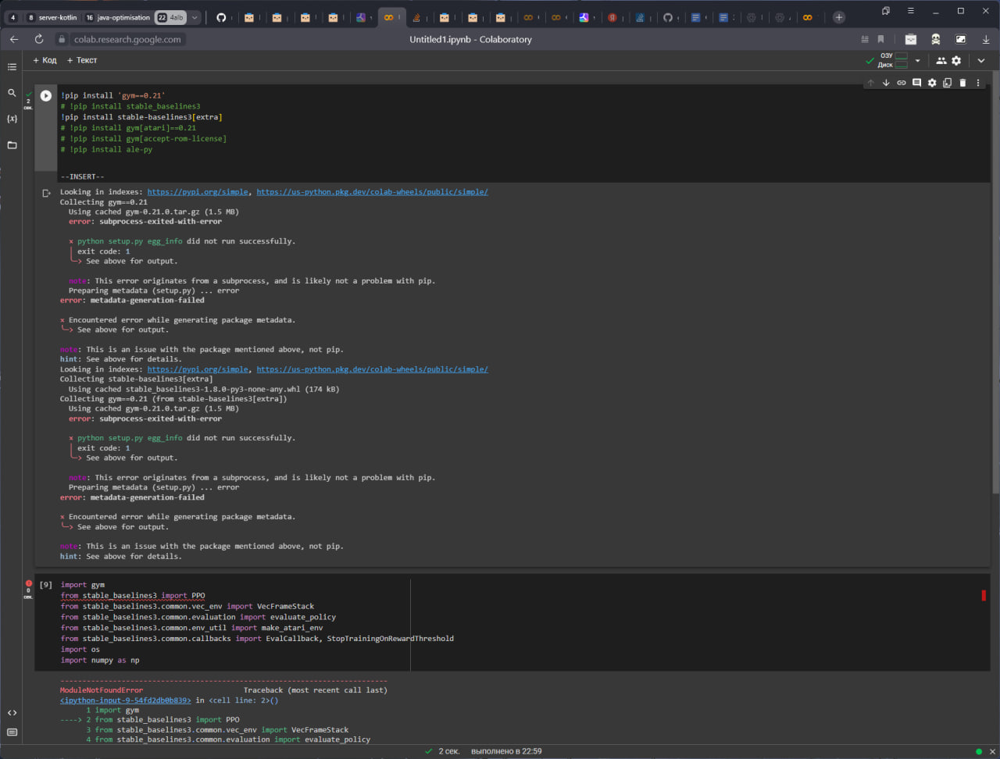
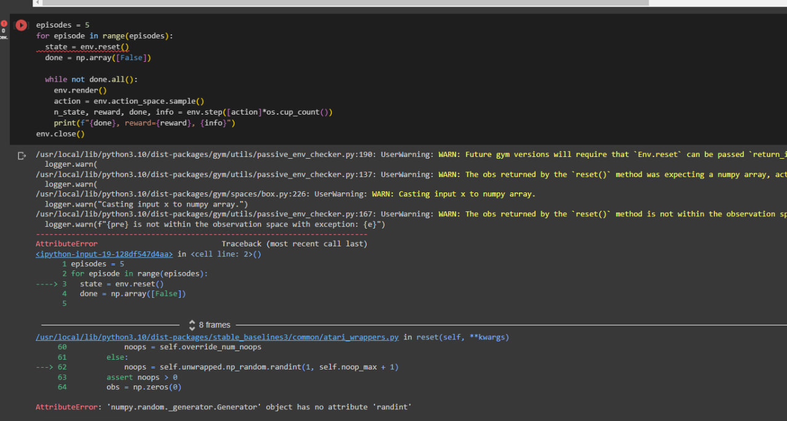
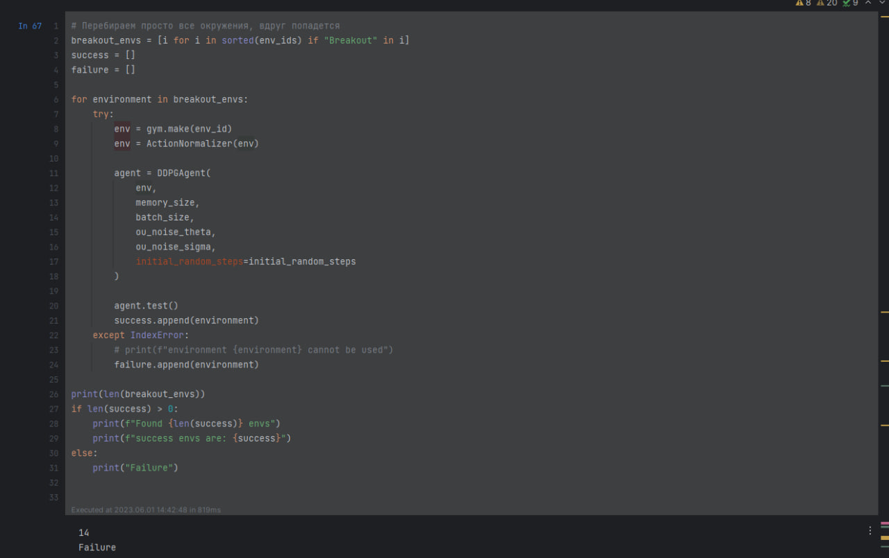

## Task itself
* Задание - обучите модель играть в одну из указанных игр Atari:
    * Enduro https://www.gymlibrary.dev/environments/atari/enduro/ - нужно избегать столкновения с машинами на трассе
    * Skiings https://www.gymlibrary.dev/environments/atari/skiing/ - нужно попадать в заданные интервалы при движении с горки
    * Tennis https://www.gymlibrary.dev/environments/atari/tennis/ - теннис
    * Breakout https://www.gymlibrary.dev/environments/atari/breakout/ - управляем платформой для отражения мячика и разбиваем ячейки
* За основу можно взять код с семинарского занятия
* Обратите внимание на то, что вы получаете в качестве входных данных (состояние среды) и как это можно поменять (другие виды среды в настройках окружения). Возможно, для выделения признаков на данных такого типа есть более эффективные слои, чем линейные
* Если необходимо, найдите эффективный способ передавать информацию о последовательности состояний (например, добавить ко входу разницу в явном виде между текущим и прошлым состояниями или просто сконкатенировать с прошлым/прошлыми состояниями)
* Если необходимо, напишите буфер реплеев с приоритизацией
* Изучите функцию награды и подумайте, как эффективно подобрать параметры
* Подумайте, как лучше организовать исследование - оставить шум из примера и использовать какую-то другую стратегию
* Особо ~~отбитым~~ интересующимся предлагаю найти и использовать другую модель - например, PPO, A2C (добавить несколько параллельных агентов и шаринг весов к этой), или найти имплементацию SoTA на играх Атари (в этом случае необходимо объяснить как модель работает по статье и разобраться в имплементации)

## results
+ Адекватный вариант тут - [link](using_PPO/using_PPO_packman.ipynb)
+ Еще один вариант (но тут gymnasium) - [work for me](from_collab/main.ipynb)

+ Пакеты постоянно не ставятся
    

+ Но даже если кажется, что всё работает, ничего не работает
  
  

+ И даже если прошло сверху, то снизу нас ждет
  

## Ideas
 + Code is not working due to None in available_actions, but it supposed to be
 Dependency hell again
 + Try to use PPO
 + Cannot use it due to dependency hell
 + Try to install numpy < 1.17
 + Cannot install it due to dependency hell
 + while installing gym need to install ale-py < 0.8.0
 + Cannot install it due to dependency hell