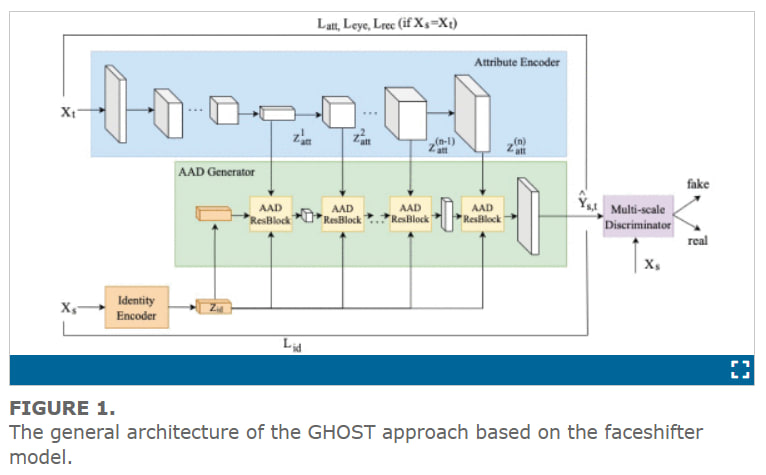
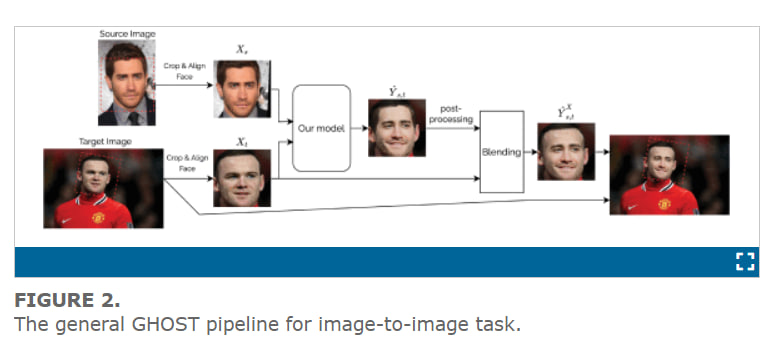
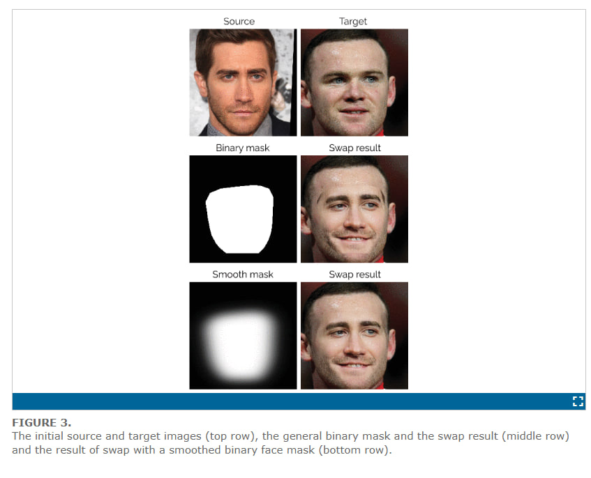

## Где расположен код модели и кто разработчик?
    Разработчиком модели выступает команда AI Сбера (исходя из названия репов и пары статей)
    Код модели можно найти на git: (на самом деле первый раз такое вижу)
        - Если клонировать -> `git clone https://github.com/sberbank-ai/sber-swap.git`
        - Если хочется открыть в браузере -> (https://github.com/ai-forever/ghost)
## Есть ли статья по работе модели? Если да, то в чем суть подхода авторов, как обучалась модель, какие метрики были достигнуты?
    Статья непосредственно самомого сбера на хабре - (https://habr.com/ru/companies/sberbank/articles/575614/)

    Публикация на Ieeexplore - (https://ieeexplore.ieee.org/abstract/document/9851423)

    Суть подхода авторов аналогична FaceShifter, но еще был добавлен дискриминатор (как в SimSwap или Few-Shot Adversarial Learning of Realistic Neural Talking Head Model) и нейронка для нахождения лица.
    Краткая суть - в модели используются под капотом 4 модели, первая используется для определения лица, вторая для вырезки лица, третья стоит новую картинку по параметрам вытащеным ранее, а после улучшает качество уже получившегося изображения и четвертая проверяет результат.

### Метрики
    Касательно метрик разрабы описывают процесс обучения нейронок с помощью других нейронок...
    Короче, была использована CoseFace model для установки качества распознавания "изначального" лица. Далее использовалась модель для распознавания 3D лиц Ringnet, а также pose estimator для оценки различных параметров лица изначального и "восстановленного" лица 

## Состоит ли модель из нескольких частей? Если да, то из каких, что они делают и как называются в коде?
    По факту, модель состоит из 4 частей (всё это можно прочитать в секции Architecture Research)
    - Identity encoder (предобученная моделька, которая вытаскивает лица с фотки) (ArcFace model was selected)
    - Attribute encoder (извлечение параметров с лиц) (UNet was the best)
    - AAD Generator ("восстановление" нового изображения по сетке параметров) (2 AAD U-Net blocks gave most valuable results)
    - Discriminator (тестирование на "настоящесть") (Непонятно, что испльзовали точно, но исследовали аж 7 раз)

## Как проходит процесс инференса модели для фото и видео (подробно)? Какие применяются преобразования входных и выходных данных?

    В статье описан стандартный pipeline. В целом он схож с FaceShifter, но есть некоторые отличия.
    Для экстракции лица с фото используется SCRFD по дефолту. В теории он позволяет вытаскивать много лиц с фотки. Дальше образуется маска лица, в данном случае - маска сегментация. Она помечает какие пиксели относятся к лицу, а какие нет (бинарное изображение). После этого происходит кроп изображения (в простонародье - вырезание). Чтобы получившийся кроп был похож на нормальный результат, используется размытие по Гауссу по краям
    В качетве примера есть вот такая картинка

    
    Когда все грани (величины вектора кропа) были обнаружены его можно сгладить, испльзуя информацию соседних кадров в случае видео

    Далее моделька корректирует результат путём изменения размера маски (если было сильно много, то зацепилось не только лицо, но и форма головы, если было мало - то получится слишком большой кроп(тут crop - увеличение))

    После этого запускается (это можно настроить параметром) Super Resolution Post-Processing - нейронка для улучшения качества изображения

    Для инференса всё работает также, только всё прогоняется для всех кадров в видео

## Можно ли дообучить модель и какие для этого требуются ресурсы? Может, авторы давали советы по обучению/дообучению? 
    
    Сами разрабы дают комментарий на тему, как будут дальше тюнить модель, но для простых смертных для дообучения модельки можно поэкспериментировать с Loss функцией, и количеством блоков в генераторе. Авторы же пишут следующее:
    "С точки зрения будущих исследований мы рассматриваем процесс тонкой настройки нашего решения в конвейере GAN, где предлагаемая архитектура будет использоваться в качестве генератора, а модели глубокого обнаружения подделок SoTA будут использоваться в качестве дискриминатора. Мы ожидаем получить эффект качества для общих и сложных случаев (условия освещения, экстремальное положение головы и т.д.). Другие будущие задачи касаются добавления функциональности конкретных атрибутов в процесс замены лиц и внедрения функции CLIP-like (контрастный язык-предварительная подготовка изображения) в наш конвейер для управления процессом замены лиц с помощью некоторая текстовая подсказка (например.например, используя текстовую подсказку “сделать губы красными”, мы можем получить результат смешивания с красными губами, даже если они не были красными на исходном изображении)."
